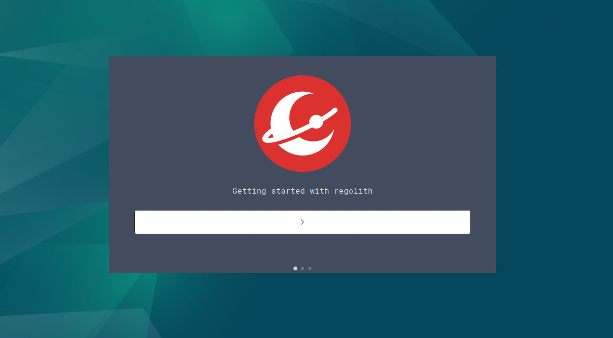
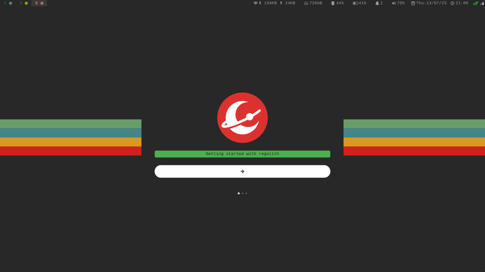
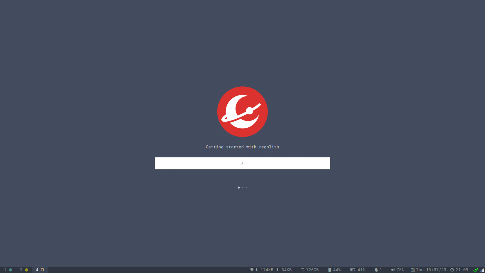

# Linux Onboarding

A first-run onboarding tool for Linux distributions — the equivalent of the
"Get Started" experience Windows and macOS ship, built so any distro can put
its own name, look and content on it.

It opens with a welcome page, walks through a few slides the distro authors,
and then offers interactive workflows that teach keyboard shortcuts by
prompting for one at a time and waiting until the user actually presses it. The
real action happens when they do, so the shortcut is learned by using it rather
than by reading a table.

Originally written for [Regolith Linux](https://regolith-desktop.com), which
remains the reference branding shipped in this repository.

## Building

```bash
meson setup build
meson compile -C build
./build/linux-onboarding
```

Build dependencies: `valac`, `meson`, `gtk+-3.0`, `libhandy-1`, `json-glib-1.0`,
`gee-0.8`, `gtk-layer-shell`, `webkit2gtk-4.1`.

On Debian and Ubuntu, `libwebkit2gtk-4.1-dev` comes from **universe**. There is
no `4.0` package on Ubuntu 24.04 and later; it must be `4.1`.

Validate a set of workflows without launching the UI:

```bash
./build/linux-onboarding --check-workflows
```

## For distro maintainers

Everything the user sees is replaceable. Point the build at your own branding
directory:

```bash
meson setup build -Dbranding_dir=/path/to/my-distro-branding
```

That directory holds your `branding.conf`, `theme.css`, logo, HTML slides and
default workflows, and all of it is compiled into the binary — a shipped build
carries its own identity and cannot lose it. Workflows are additionally
discovered from disk at runtime, so they can be extended after release.

**→ [docs/DISTRO-GUIDE.md](docs/DISTRO-GUIDE.md)** covers the directory layout,
`branding.conf`, the theming contract, the workflow JSON schema, how workflows
are keyed by desktop environment, and how to lay out a marketplace repository.

## Which desktops are supported

| Desktop | Interactive practice |
|---|---|
| sway | Yes — WM binding mode + IPC, no input grab |
| i3 | Yes — WM binding mode + IPC; keys synthesized (no resolver) |
| Any X11 session | Yes — keyboard-only seat grab |
| GNOME on Wayland | Yes* — keyboard-only seat grab → `zwp_keyboard_shortcuts_inhibit_v1` |
| KDE (KWin) on Wayland | Yes* — same keyboard-only grab mechanism |

\* GNOME and KDE are **code-complete but unauthored**: practice works end-to-end
the moment a `workflows/gnome`/`workflows/kde` set is supplied, but no such
workflow ships with the reference branding yet, so practice has nothing to teach
there until someone authors it.

Where practice is unavailable the app says so plainly and presents the same
workflows as a reference card. Branding, slides and the catalogue work
everywhere.

## How it fits together

```
src/
├── platforms/     per-desktop code; each implements a subset of five contracts
│   ├── sway/      binding mode + IPC observation, resolution, dispatch
│   ├── x11/       keyboard-only seat grab, X11 dispatch
│   ├── gnome/     seat-grab observation, GSettings resolution, dispatch
│   ├── wayland/   generic Wayland window placement
│   ├── platform.vala     the Platform interface
│   └── registry.vala     the compile-time ordered platform list
├── keys/          key parsing, safe keysym shapes, the binding-mode sanitiser
├── branding/      the compiled-in distro identity
├── slides/        WebKit-rendered featured slides
├── workflows/     workflow model, tolerant parser, layered discovery
├── flow/          the catalogue and the step-by-step practice page
└── intro/         the welcome page
```

`platforms/` is the part worth knowing about. Detecting that a shortcut was
pressed differs enough between desktops that it cannot be one code path, so the
app is built around five **capability contracts** — `SessionProbe`,
`ShortcutObserver`, `BindingResolver`, `ActionDispatcher`, `WindowPlacer` — and
each desktop family implements the subset it can. The registry walks a
**compile-time ordered list** of platforms and, for each capability, takes the
first one that claims the session and offers a working implementation:

- **sway / i3** write a binding mode into the WM's `config.d` and subscribe to
  binding events over IPC. Keys are bound to `nop` inside the mode, so a press
  is observed without the WM acting on it, and the app then performs the real
  action itself by resolving what the key is normally bound to. No input grab,
  so the rest of the desktop stays usable.
- **X11** grabs the seat and reads GTK key events.
- **GNOME / KDE on Wayland** use the same keyboard-only seat grab, which GTK3
  turns into the `zwp_keyboard_shortcuts_inhibit_v1` request — the compositor
  then feeds the app the key presses.

Two decisions worth reading in `docs/adr/`: the keyboard-only grab and why the
grab can never re-assert itself (`0001`), and the compile-time registry over
runtime plugins (`0002`).

## Adding a desktop

Create one directory under `src/platforms/`, add one line to the registry's
list in `src/platforms/registry.vala`, and one `subdir()` to
`src/platforms/meson.build`. No shared code changes. The platform declares which
session it owns and returns whichever of the five contracts it implements; the
rest fall through to the next platform. Worked example and the full contract:
**→ [docs/DISTRO-GUIDE.md](docs/DISTRO-GUIDE.md)**.

## Screenshots






## Licence

Apache 2.0. See [LICENSE](LICENSE).
